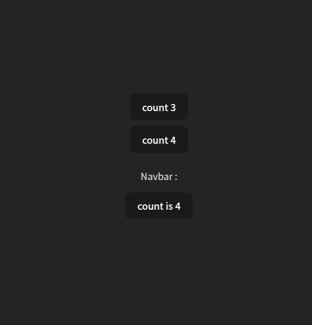

# Context-API-03


 
---
## 📂 Project File Structure
```
# Context-API-03/
│── public/   
│   └── vite.svg
│
│── src/
│   ├── assets/
│   │   └── overview/
│   │       └── overview.png                
│   └── components/
│       ├── Navbar/
│       │   └── Navbar.jsx
│       ├── SideNav/
│       │   └── SideNav.jsx
│       └── LastNav/
│           └── LastNav.jsx


```